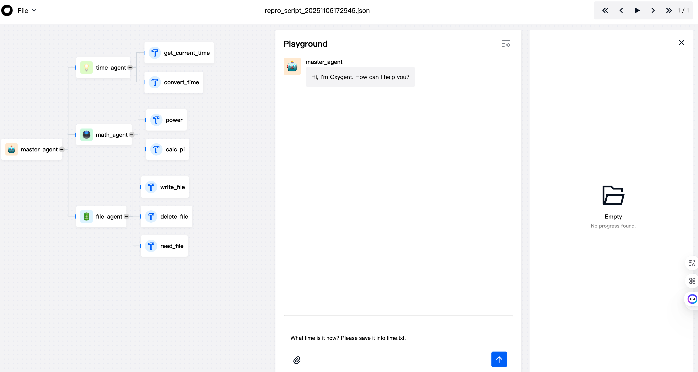

[中文](./README_zh.md)

<p align="center">
  <a href="https://github.com/jd-opensource/JDOxyGent4J/pulls">
    
  </a>
  <a href="https://github.com/jd-opensource/JDOxyGent4J/blob/main/LICENSE">
    
  </a>
  <a href="https://search.maven.org/search?q=g:com.jd.oxygent%20AND%20a:JDOxyGent4J">
    
  </a>
  <a href="https://www.oracle.com/java/technologies/javase/jdk17-archive-downloads.html">
    
  </a>
</p>


<h2 align="center">一个先进的Java框架，使开发者能够快速构建生产级智能系统。</h2>

<div align="center">

**🌐 访问官网：** [OxyGent](http://oxygent.jd.com) | **📚 开源地址：** [Python版本](https://github.com/jd-opensource/OxyGent) | [Java版本](https://github.com/jd-opensource/JDOxyGent4J)

</div>

## 🔍 1. 项目概述

OxyGent 是一个开源的多智能体框架，将 Agent / LLM / Tool 统一为可组合的 Oxy 组件，提供透明的端到端流水线与可编排能力，支持在生产环境下持续演进与无限扩展。

JDOxyGent4J 与 Python 版本理念一致，并针对 Java 生态深度优化：原生类型安全与编译期校验、Spring Boot 无缝集成、企业级并发与稳定性、面向 Java 开发者的友好 API。

JDOxyGent4J 已在多个实际业务场景中得到验证和应用，证明了其在生产环境下的稳定性与扩展性。

---

## ⚡ 2. 核心特性

⚙️ **Java生态深度集成**
- 无缝集成Spring Boot和Java EE标准，提供类型安全的智能体开发体验。支持通过注解和配置文件快速定义智能体行为，利用Java生态的成熟工具链和依赖注入机制，加速企业级AI应用开发。

🛡️ **企业级可靠性保障**
- 继承Java平台的安全模型和异常处理机制，确保智能体系统在生产环境下的稳定运行。提供完整的访问控制、审计日志和可观测性支持，满足企业级应用的安全与合规要求。

⚡ **高性能并发处理**
- 基于Java的并发编程模型，实现智能体任务的高效异步执行。支持大规模智能体并发运行，智能体间通信采用非阻塞IO，在并发性能测试中相比Python版本有显著提升。

🔄 **灵活配置与可扩展存储**
- 提供统一的基础设施抽象层和灵活的配置体系，支持用户自定义扩展各种存储实现（数据库、缓存、向量库等）。通过配置驱动的架构设计，可轻松适配本地开发、云端部署和企业级运行环境，实现存储层的热插拔与无缝迁移。


---

## 🗂️ 3. 项目结构

```
JDOxyGent4J/
├── oxygent-core/                  # 核心：Agent/LLM/Tool/MAS 与示例
│   └── src/main/java/com/jd/oxygent/core/
│       ├── Config.java            # 全局配置
│       ├── Mas.java               # 多智能体系统（MAS）核心
│       ├── MasFactoryBean.java    # Spring 集成与空间管理
│       ├── oxygent/oxy/           # 组件实现
│       │   ├── agents/            # Chat/ReAct/Workflow/RAG/SSE/Parallel 等
│       │   ├── llms/              # HttpLlm、OpenAiLlm 等
│       │   ├── function_tools/    # FunctionHub、FunctionTool
│       │   └── mcp/               # StdioMCPClient、SSEMCPClient
│       ├── oxygent/schemas/       # 请求/响应/内存/上下文/异常/观测
│       ├── oxygent/infra/         # 数据库、RAG、多模态抽象
│       ├── oxygent/samples/       # 示例代码与服务器
│       ├── tools/                 # 预设工具与示例工具
│       └── utils/                 # 通用工具类
├── oxygent-infra/                # 基础设施实现
├── oxygent-starter-core/          # Spring Boot Starter（自动装配）
├── oxygent-studio/                # Web 示例与演示 UI
├── docs/                          # 文档（中文在 docs/docs_zh）
└── cache_dir/                     # 本地缓存目录
```

## 🚀 4. 快速开始

> 💡 **快速上手建议**：
> - 阅读 [docs/](docs/docs_zh/README.md) 获取完整架构与设计文档
> - 运行 [samples/](oxygent-core/src/main/java/com/jd/oxygent/core/oxygent/samples/DemoInReadme.java) 中的 30+ 示例，覆盖主流 Agent 模式与应用场景


### 环境要求
- Java 17+
- Maven 3.6+
- Spring Boot 3.2.5+

### 安装方式

#### 方式一：Maven依赖（推荐）
```xml
<dependency>
    <groupId>com.jd.oxygent</groupId>
    <artifactId>oxygent-core</artifactId>
    <version>1.0.0</version>
</dependency>
```

#### 方式二：本地构建
```bash
git clone https://github.com/jd-opensource/JDOxyGent4J.git
cd JDOxyGent4J
mvn clean install -DskipTests
```

### 启动参数（必需）
由于使用反射和动态代理，需添加以下 JVM 参数：
```
--add-opens java.base/java.lang=ALL-UNNAMED
--add-opens java.base/java.lang.reflect=ALL-UNNAMED
--add-opens java.base/java.util=ALL-UNNAMED
--add-opens java.base/sun.util.calendar=ALL-UNNAMED
--add-opens java.base/java.math=ALL-UNNAMED
```
####  可参考IDEA配置 [idea_env_vm_config](docs/images/idea_env_vm_config.png)
```
ENV Config
OXY_LLM_API_KEY= "你的API密钥"
OXY_LLM_BASE_URL= "你的基础URL"
OXY_LLM_MODEL_NAME= "你的模型名称"

VM config
--add-opens java.base/java.lang=ALL-UNNAMED --add-opens java.base/java.util=ALL-UNNAMED --add-opens java.base/sun.util.calendar=ALL-UNNAMED --add-opens java.base/java.math=ALL-UNNAMED --add-opens java.base/sun.security.action=ALL-UNNAMED --add-exports=java.base/sun.net.util=ALL-UNNAMED
```

####  或者启动IDEA配置脚本 （必需）
```bash
# 回到项目根目录
cd ../..
# mac或linux系统使用如下命令
./setup-idea.sh
#windows系统使用如下命令
setup-idea-windows.bat
#或双击setup-idea-windows.bat配置即可
```

###  📚 详细示例

项目提供了多个完整的示例，位于 [SAMPLES.md](oxygent-core/SAMPLES_zh.md)；更多教程请阅读 `docs/docs_zh`。

示例启动后可预览前端页面：

- 示例
```java
import com.jd.oxygent.core.Mas;
import com.jd.oxygent.core.oxygent.oxy.llms.HttpLlm;
import com.jd.oxygent.core.oxygent.oxy.agents.ReActAgent;
import com.jd.oxygent.core.oxygent.oxy.BaseOxy;
import com.jd.oxygent.core.oxygent.tools.PresetTools;
import com.jd.oxygent.core.utils.EnvUtils;

import java.util.Arrays;
import java.util.HashMap;
import java.util.List;
import java.util.Map;

public class DemoInReadme {

    public static void main(String[] args) throws Exception {
        List<BaseOxy> oxySpaceList = getDefaultOxySpace();
        Mas mas = new Mas("app", oxySpaceList);
        mas.setOxySpace(oxySpaceList);
        mas.init();

        Map<String, Object> info = new HashMap<>();
        info.put("query", "What time is it now? Please save it into time.txt.");

        System.out.println("Starting chatWithAgent request");
        mas.chatWithAgent(info);
    }
    
    public static List<BaseOxy> getDefaultOxySpace() {
        return Arrays.asList(
                HttpLlm.builder()
                        .name("default_llm")
                        .apiKey(EnvUtils.getEnv("OXY_LLM_API_KEY"))
                        .baseUrl(EnvUtils.getEnv("OXY_LLM_BASE_URL"))
                        .modelName(EnvUtils.getEnv("OXY_LLM_MODEL_NAME"))
                        .llmParams(Map.of("temperature", 0.01)) // Use Map.of to create immutable Map
                        .timeout(30)
                        .build(),

                // 2. Time tools (assuming preset_tools.time_tools is a predefined Tool instance)
                PresetTools.TIME_TOOLS, // Need to define PresetTools class

                // 3. Time agent
                ReActAgent.builder()
                        .name("time_agent")
                        .desc("A tool that can query the time")
                        .tools(Arrays.asList("time_tools")) // Tool name list
                        .build(),
                // 4. File tools
                PresetTools.FILE_TOOLS,

                // 5. File agent
                ReActAgent.builder()
                        .name("file_agent")
                        .desc("A tool that can operate the file system")
                        .tools(Arrays.asList("file_tools"))
                        .build(),

                // 6. Math tools
                PresetTools.MATH_TOOLS,
                // 7. Math agent
                ReActAgent.builder()
                        .name("math_agent")
                        .desc("A tool that can perform mathematical calculations.")
                        .tools(Arrays.asList("math_tools"))
                        .build(),

                // 8. Master Agent
                ReActAgent.builder()
                        .isMaster(true) // Set as master agent
                        .name("master_agent")
                        .llmModel("default_llm")
                        .subAgents(Arrays.asList("time_agent", "file_agent", "math_agent")) // Sub-agent list
                        .build()
        );
    }
}
```


## 🔧 运行 Web 应用（示例 UI + API）

### 启动方式
- 方式一（推荐，开发模式）：
    - `cd oxygent-studio && mvn spring-boot:run`
- 方式二（直接运行主类）：
    - 主类：`com.jd.oxygent.web.OpenOxySpringBootApplication`
    - 在IDE中运行或使用 `mvn -pl oxygent-studio exec:java -Dexec.mainClass=com.jd.oxygent.web.OpenOxySpringBootApplication`

- 方式三：Spring Boot
```java
@SpringBootApplication
public class OpenOxySpringBootApplication {
    public static void main(String[] args) {
        SpringApplication.run(OpenOxySpringBootApplication.class, args);
    }
}
```

### 访问地址
- Web 示例页：`http://localhost:8080`


## 🤝 6. 贡献指南

我们欢迎任何形式的贡献！包括但不限于：
- 🐞 提交 Bug 或复现问题
- 💡 提出新功能或改进建议
- 📚 改进文档或补充示例
- 🧑‍💻 提交 Pull Request（请基于 `dev` 分支）

**贡献流程**：
1. Fork 本仓库
2. 创建 feature 分支 (`git checkout -b feat/your-feature`)
3. 提交代码并推送
4. 发起 Pull Request

我们感谢各种形式的贡献！🎉🎉🎉
如果您在开发过程中遇到问题，请查看我们的文档：* **[文档](docs/)**
---

## 📣 7. 社区与支持
关注文档更新：[docs/](docs/)   
如果你在OxyGent的开发或使用过程中遇到任何问题，欢迎在项目的Issue区域提交可复现的步骤或日志片段。
  如果您有企业内部Slack，请直接联系OxyGent Core团队。    
欢迎沟通和联系我们:

<div align="center">
  
</div>

---

## 🙏 8. 致谢

感谢所有为 OxyGent 项目做出贡献的开发者！

---

## 📄 9. 开源协议

本项目采用 **Apache License 2.0** 开源协议。  
© 2025 京东 OxyGent 团队 —— 让智能体开发更简单、更高效！

---
